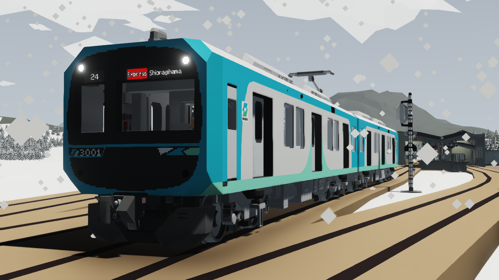
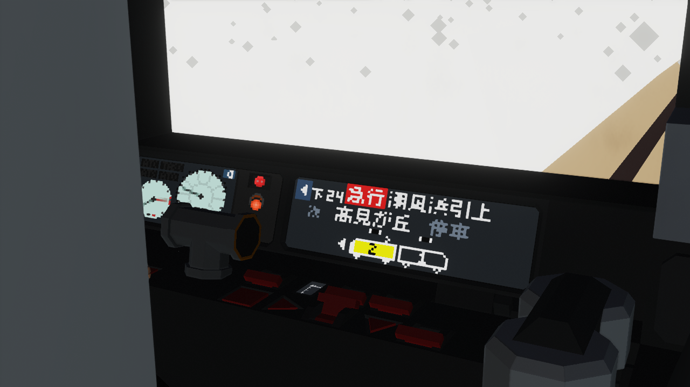
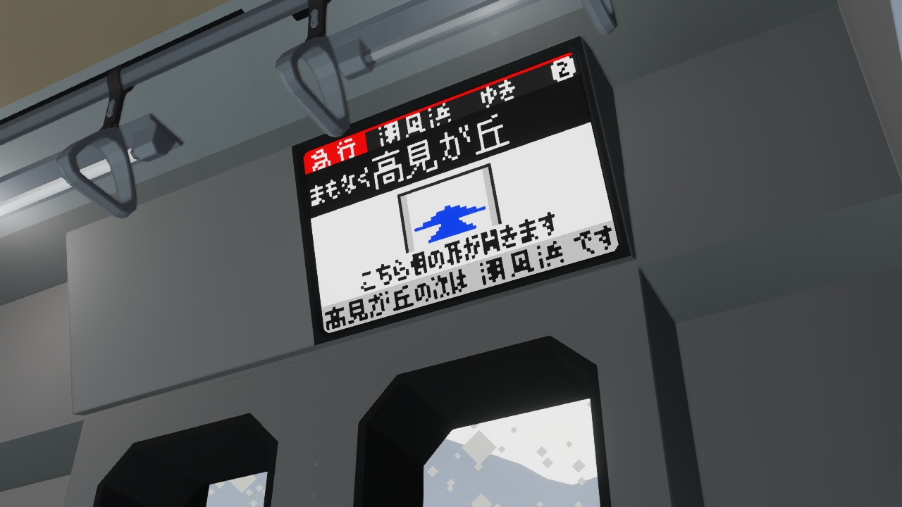
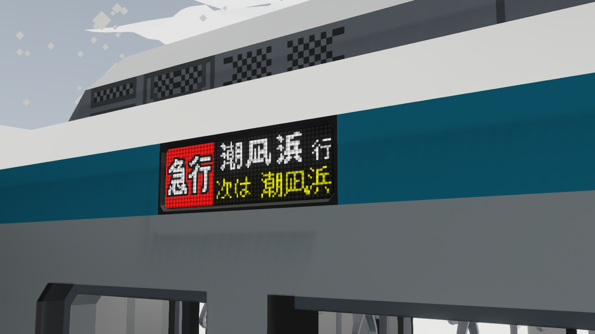

> **Callout:** この記事は [Stormworks 第1 Advent Calendar 2024](https://adventar.org/calendars/9924) 第 6 日目の記事です。

<ruby>
  NITS<rt>ニッツ</rt>
</ruby> は、高原のな 独自の Stormworks 鉄道車両用 総括制御システムです。

[昨年のアドベントカレンダー記事](./entry8.html)にて紹介していますが、結局現況の写真を撮り忘れていますね……　気が向いたときにアップロードします。

今回は、未だにクローズドベータが続いているNITSについて、その利用例を一つ紹介します。

## 広がるNITS採用車

わたしが主体となって進めている架空電車プロジェクト <ruby>中宗電鉄<rt>ちゅうそうでんてつ</rt></ruby> の中で、ここ数年の新車をモデルにした車両の制御をTeinishi氏に制作していただいております。

この車両にもNITSを採用していただきました。以下の画像で見られるような、大がかりなデータ伝送を行っています。

これらは、NITSの共通コマンドに加えて、車両の情報を他車に知らせるコマンド、電車の運行番号、種別、行先、走行位置を知らせるコマンドを設定し、各車に配信することで実現しています。

## NITSのこれから

NITSの特徴は、車両間の情報到達時間差がデイジーチェーン方式の中では最小となることと、多数のコマンドを持った通信が行えることです。

NITSは、この一年間でバグ出しを十分に行い、制御の開発方法に一定の指針を得ることができました。2025年は、NITSを多くの人に向けてリリースし、到達時間差最小・高機能な鉄道総括制御を体験していただくことができたらと考えております。
