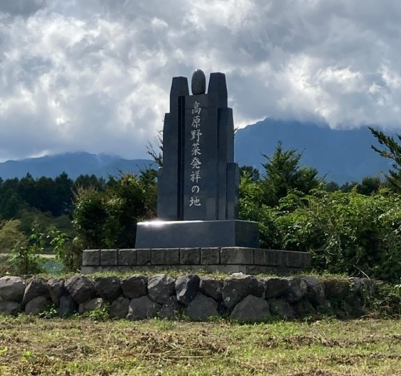
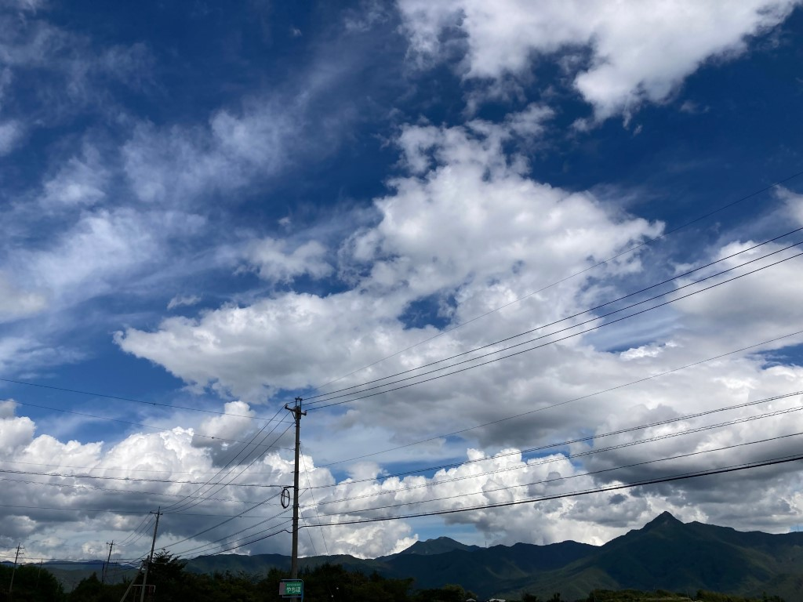

いつの間にかこーげんやさいの色が変わっていましたね。この記事では、色変更を含む外観の更新について覚えている範囲で書き留めておきます（実はデザインアップデート自体はまだ途中です）。

### テーマカラーは青緑から青へ

<figure class="float-r" style="margin: 1ic;">
 
<figcaption>Figure 1. 以前の色</figcaption>
</figure>

以前は水色から青緑あたりのグラデーションを使用していました。これらの色は色覚の観点からして非常に厄介な領域を含んでいたため、ベース色・アクセント色の対比の設計が非常に困難になっていました。

この対比をはっきりさせるには、使用する色を赤または青に寄せる必要があります。そこでわたしは、高原野菜の産地の夏の青空の色を新しい色にすることを決めました。

夏もほとんど終わりの 2023 年 9 月 14 日、[スパークリング湯豆腐](https://twitter.com/Spetsnaz10032)氏とともに、長野県南佐久郡南牧村に向かいました。

我々は、空にカラーピッカーを映したスマホの画面を掲げ、色を合わせました。その時の色をもとに、少し見栄えを考慮して調整を加えた次の 2 色を新しい色と定めました。

-  参考値 `#72aaff`
-  参考値 `#284d84`

現時点では、こーげんやさいサイトのみ配色が切り替わっていますが、今後適用範囲を増やしていくことになっています。

### フォントの方針転換

[新鮮こーげんやさい](./entry1.html)を書いた 2022 年ごろは、リッチな見た目の排除による画一化が重要になると考えていましたが、現在はどちらかというとアイデンティティのアピールこそが重要になると考えています。

そんなことを考えていた時期に出会った [Zen Kaku Gothic New](https://fonts.google.com/specimen/Zen+Kaku+Gothic+New) の造形の美しさに惹かれ、高原のなのアイデンティティを表すフォントとして使用することを決めました。なお、欧文文字が微妙に好みからずれていたため [Red Hat Text](https://fonts.google.com/specimen/Red+Hat+Text) との混植としています。また、等幅書体は Consolas が好みということもあり、[Inconsolata](https://fonts.google.com/specimen/Inconsolata)を使用しています。

### より良い時刻の処理

ECMAScript 標準の Date は非常に苦しい仕様となっています。そのような苦しさをやめてもっとモダンな方法にしようと [Temporal](https://tc39.es/proposal-temporal/docs/index.html) という時刻 API が開発・議論されています。

今回の外観アップデートの際に、どうせならということで、Date を使用していた部分の一部を `@js-temporal/polyfill` による方法に置き換えました。あと少しだけ Date を使用している部分があるので、追って置き換え予定です。これによりタイムゾーン処理が簡潔かつ適切なものになっているはずです。

---

以上が現時点での主な変更点になります。

先にも述べたように、デザインアップデートはまだ未完了です。次はトップページやブログトップページの操作性の改善を予定しています。
